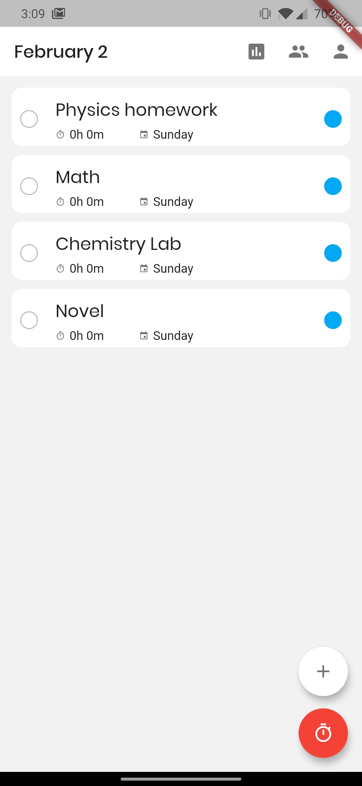
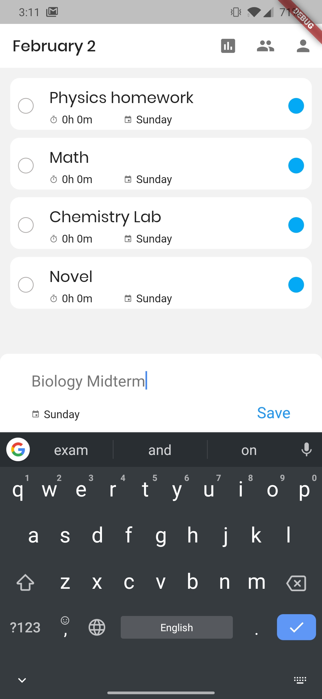
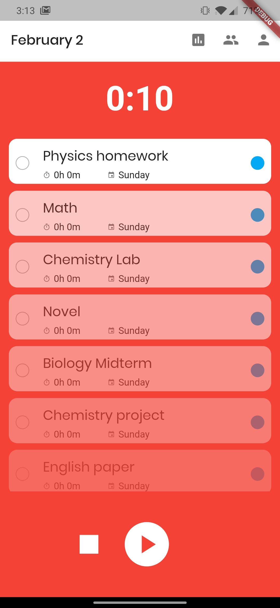
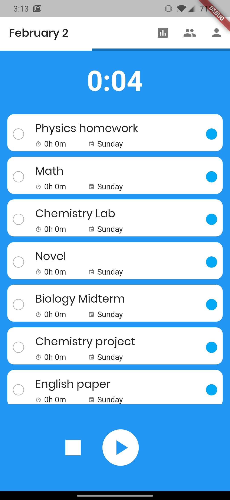
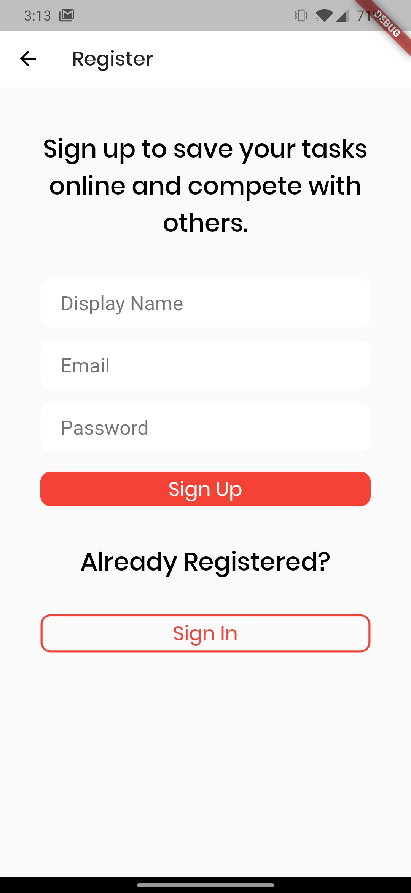
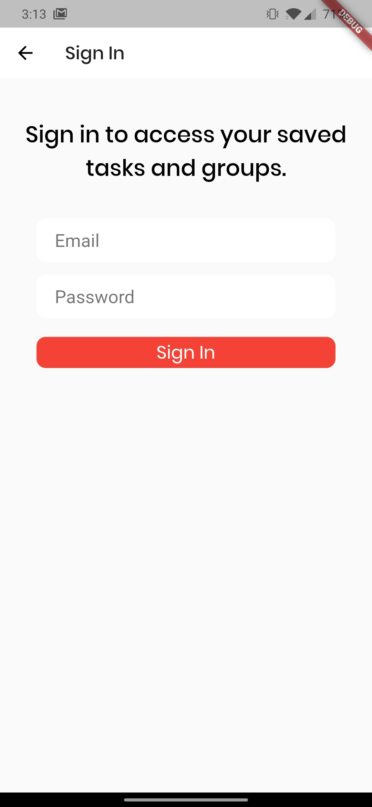
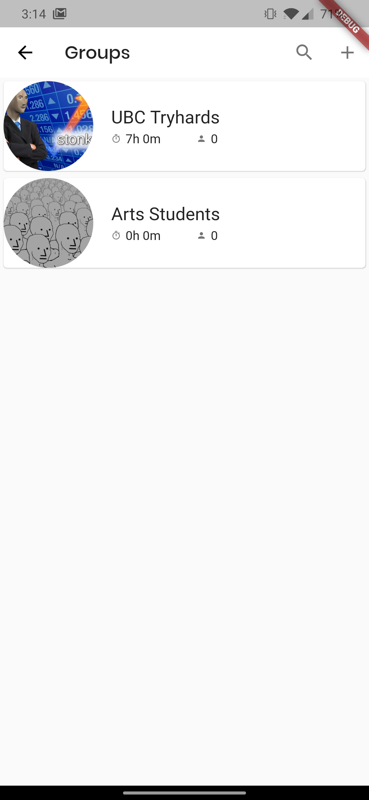

# Pomotask

In my third year of studying my friends and I discovered the power of the Pomodoro technique - focus for 25 minutes then take a 5 minute break. After mastering the technique we wanted to use an app to make it easier and be held accountable. We found a couple of apps that worked alright, but we often found their interfaces frustrating or did not have all the features we wanted.

It was at this point that I decided to create my own app for task management. I chose to use [Flutter](https://flutter.dev) in order for efficient, multi-platform support and because of previous experience using ReactJS. I also used [Redux](https://blog.novoda.com/introduction-to-redux-in-flutter/)
 for Flutter to centralize the state variables to be used on any widget.

## Features

* Create a list of tasks to complete with due dates and categories. Reorder the priority of tasks and track time spent on each task
* Track how much time spent on tasks and compete with friends.
* Store tasks in the cloud to sync to any device through a user created account.

## Screenshots

## Development Team

* Erik Langille - Lead Developer
* James Ryeburn - Developer (Groups)
